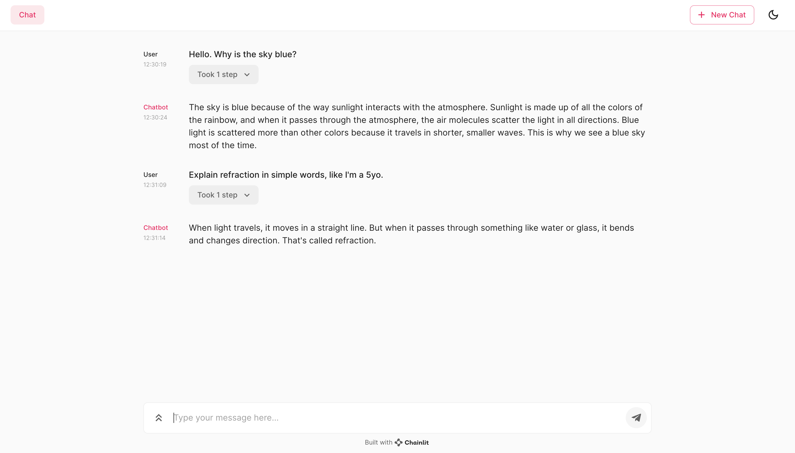

# chainlit
A simple Chainlit app for generative question-answering with LangChain and OpenAI.

[LangChain](https://langchain.readthedocs.io/en/latest/) is an open-source framework created to aid the development of applications leveraging the power of large language models (LLMs). [Chainlit](https://docs.chainlit.io), on the other hand, is an open-source Python package that makes it incredibly fast to build and share LLM apps.

To start the app, run `chainlit run app.py -w` from the directory that contains `app.py`; the `-w` flag enables auto-reload.

